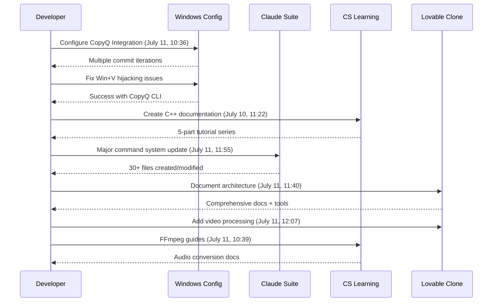
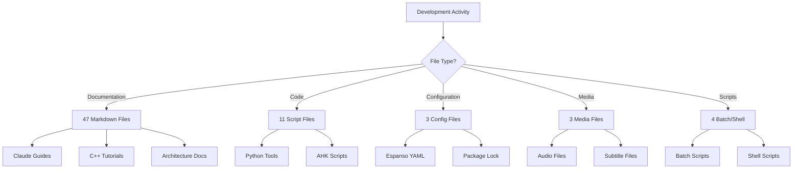
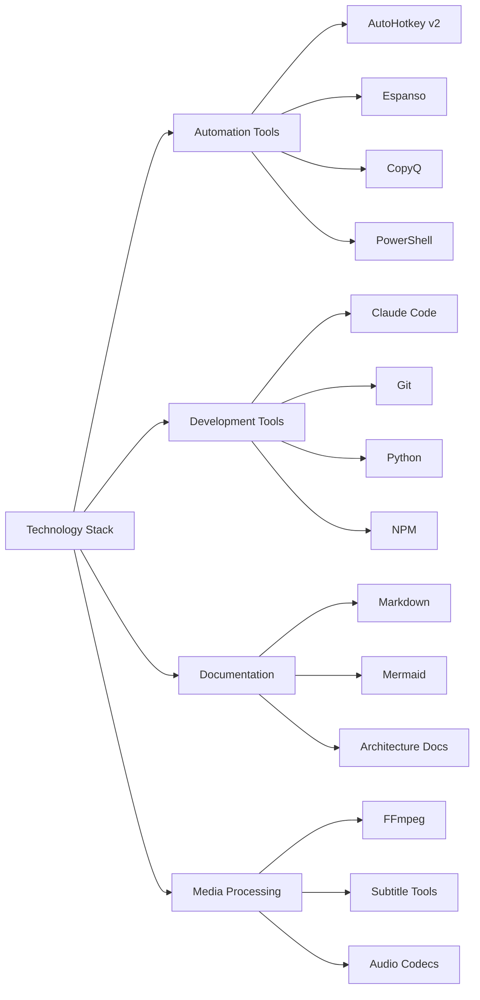

# Development Activity Summary - Past 52 Hours

## Overview
This document provides a comprehensive analysis of all development activities and changes made between July 11-13, 2025, across the entire project workspace, covering approximately 52 hours of active development.

## Key Terms
- **Claude Code**: Anthropic's AI-powered development assistant and CLI tool
- **Lovable Clone**: A project reverse-engineering or replicating Lovable's functionality
- *AutoHotkey (AHK)*: Windows automation scripting language for hotkeys and macros
- *Espanso*: Cross-platform text expander tool
- `CopyQ`: Advanced clipboard manager with history
- **Git Commit**: Version control snapshot of code changes
- *FFmpeg*: Multimedia framework for audio/video processing
- `C++ Compilation`: Process of transforming C++ source code to executable
- **Mermaid Diagrams**: Text-based diagramming tool for documentation

## Development Activity Timeline

### Project Activity Distribution
This diagram shows how development effort was distributed across different projects during the 52-hour period.

```mermaid
%%{init: {
  'theme':'base',
  'darkMode': true,
  /* --- light-mode palette --- */
  'themeVariables': {
    'primaryColor':'#ffffff',
    'primaryTextColor':'#1a1a1a',
    'secondaryColor':'#f7f7f7',
    'secondaryTextColor':'#1a1a1a',
    'primaryBorderColor':'#1a1a1a',
    'lineColor':'#1a1a1a'
  },
  /* --- dark-mode palette --- */
  'darkThemeVariables': {
    'primaryColor':'#1a1a1a',
    'primaryTextColor':'#ffffff',
    'secondaryColor':'#333333',
    'secondaryTextColor':'#ffffff',
    'primaryBorderColor':'#ffffff',
    'lineColor':'#ffffff'
  }
}}%%
graph TB
    A[52-Hour Development Period] --> B[Claude-Command-Suite]
    A --> C[lovable-clone-tutorial]
    A --> D[windows-config]
    A --> E[cs-learning]
    A --> F[debugging-windows]
    
    B --> B1[30+ Files Modified]
    B --> B2[Command System]
    B --> B3[Tutorial Creation]
    
    C --> C1[Documentation Suite]
    C --> C2[Video Processing]
    C --> C3[Architecture Docs]
    
    D --> D1[AHK Enhancements]
    D --> D2[CopyQ Integration]
    D --> D3[Espanso Config]
    
    E --> E1[C++ Tutorials]
    E --> E2[FFmpeg Guides]
    E --> E3[Lovable Analysis]
    
    F --> F1[Event Analysis]
```

#### Node Glossary

| Node | Meaning |
|------|---------|
| 52-Hour Development Period | Overall timeframe being analyzed |
| Claude-Command-Suite | Project for Claude Code command management |
| lovable-clone-tutorial | Documentation project for Lovable clone |
| windows-config | Windows automation and configuration project |
| cs-learning | Computer science educational content |
| debugging-windows | Windows debugging and analysis project |
| 30+ Files Modified | Large-scale changes to command suite |
| Command System | Infrastructure for Claude commands |
| Tutorial Creation | Educational content development |
| Documentation Suite | Comprehensive documentation set |
| Video Processing | Subtitle and audio extraction tools |
| Architecture Docs | Technical architecture documentation |
| AHK Enhancements | AutoHotkey script improvements |
| CopyQ Integration | Clipboard manager integration |
| Espanso Config | Text expander configuration |
| C++ Tutorials | Educational C++ content |
| FFmpeg Guides | Multimedia processing documentation |
| Lovable Analysis | Analysis of Lovable platform |
| Event Analysis | Windows event log analysis |

### Development Workflow Sequence
This sequence diagram illustrates the typical development workflow observed during the 52-hour period.

#### Node Glossary

| Node | Meaning |
|------|---------|
| Developer | The person performing development tasks |
| Windows Config | Windows automation configuration system |
| Claude Suite | Claude Command Suite project |
| CS Learning | Computer science learning materials |
| Lovable Clone | Lovable clone tutorial project |

### File Type Distribution Flow
This flowchart shows how different file types were created and modified during development.

#### Node Glossary

| Node | Meaning |
|------|---------|
| Development Activity | Root of all file creation/modification |
| File Type? | Decision point for categorizing files |
| 47 Markdown Files | Total documentation files created |
| 11 Script Files | Programming scripts in various languages |
| 3 Config Files | Configuration files for tools |
| 3 Media Files | Audio and subtitle files |
| 4 Batch/Shell | Command line scripts |
| Claude Guides | Documentation for Claude Code |
| C++ Tutorials | Educational C++ content |
| Architecture Docs | Technical architecture documentation |
| Python Tools | Python utility scripts |
| AHK Scripts | AutoHotkey automation scripts |
| Espanso YAML | Text expander configuration |
| Package Lock | NPM package lock file |
| Audio Files | M4A and Opus audio files |
| Subtitle Files | ASS and SRT subtitle formats |
| Batch Scripts | Windows batch files |
| Shell Scripts | Unix shell scripts |

### Technology Stack Architecture
This diagram illustrates the various technologies and tools used across the projects.

#### Node Glossary

| Node | Meaning |
|------|---------|
| Technology Stack | Complete set of technologies used |
| Automation Tools | Tools for automating Windows tasks |
| Development Tools | Software development utilities |
| Documentation | Documentation technologies |
| Media Processing | Audio/video processing tools |
| AutoHotkey v2 | Latest version of AHK scripting |
| Espanso | Text expansion utility |
| CopyQ | Clipboard history manager |
| PowerShell | Windows command line shell |
| Claude Code | AI development assistant |
| Git | Version control system |
| Python | Programming language for tools |
| NPM | Node.js package manager |
| Markdown | Documentation markup language |
| Mermaid | Diagram generation from text |
| Architecture Docs | System design documentation |
| FFmpeg | Multimedia framework |
| Subtitle Tools | SRT/ASS conversion utilities |
| Audio Codecs | Opus and M4A audio formats |

## Major Achievements

### 1. Claude Command Suite Enhancement
- **Scale**: 30+ files created/modified
- **Features**: 
  - Comprehensive Claude Code guide
  - Interactive command selection system
  - Tutorial framework
  - Analysis tools

### 2. Lovable Clone Documentation
- **Architecture Documentation**: Complete technical breakdown
- **Development Setup**: Step-by-step guides
- **Media Processing**: Video subtitle extraction and conversion
- **Security Analysis**: Permission system documentation

### 3. Windows Automation Improvements
- **CopyQ Integration**: Fixed Win+V hijacking by Microsoft 365
- **AutoHotkey Updates**: Enhanced library modules
- **Espanso Configuration**: Updated text expansion rules
- **Auto-Restart**: PowerShell-based AHK monitoring

### 4. Educational Content Creation
- **C++ Compilation Series**: 5-part deep dive
- **Day C++ Programming**: Pattern analysis and optimization
- **FFmpeg Tutorials**: Audio conversion workflows
- **Lovable Platform Analysis**: Technical breakdown

## Technical Insights

### Git Activity Patterns
- **Peak Activity**: July 11, 10:36-12:09
- **Commit Style**: Iterative problem-solving (Win+V fixes)
- **Documentation First**: Heavy emphasis on guides and tutorials

### Development Priorities
1. **Tool Integration**: Seamless workflow automation
2. **Documentation**: Comprehensive guides for complex topics
3. **Educational Value**: Creating reusable learning materials
4. **Problem Solving**: Persistent iteration on Windows issues

### File Organization
- **Project Separation**: Clear boundaries between projects
- **Documentation-Heavy**: 47 MD files vs 11 code files
- **Tool Scripts**: Python for processing, AHK for automation

## Future Recommendations

### Immediate Actions
1. **Test Claude Command Suite**: Verify all 30+ new components
2. **Validate CopyQ Integration**: Ensure Win+V works consistently
3. **Review Documentation**: Check for completeness and accuracy

### Short-term Goals
1. **Consolidate Tools**: Create unified command interface
2. **Automate Testing**: Add test scripts for AHK functions
3. **Video Tutorial**: Record Lovable clone implementation

### Long-term Vision
1. **Knowledge Base**: Build searchable documentation system
2. **Cross-Platform**: Extend automation beyond Windows
3. **AI Integration**: Deeper Claude Code workflows

## Conclusion

The past 52 hours demonstrate a highly productive development period focused on:
- **Tool Development**: Creating comprehensive Claude Code tooling
- **Documentation**: Extensive technical writing and tutorials
- **Automation**: Solving complex Windows integration challenges
- **Education**: Building reusable learning resources

The emphasis on documentation (47 files) and systematic problem-solving (Win+V iteration) shows a mature development approach prioritizing maintainability and knowledge sharing.