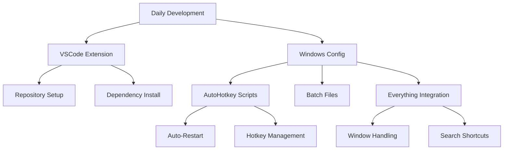
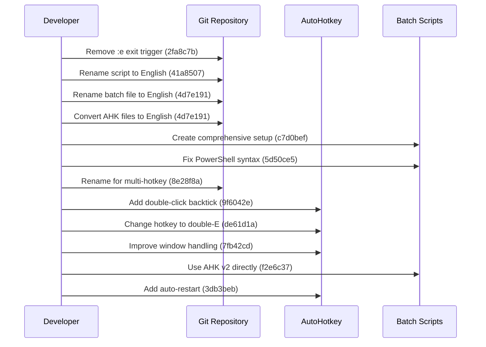
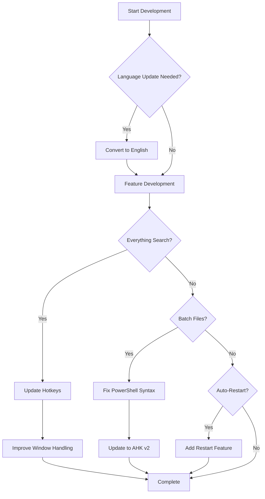
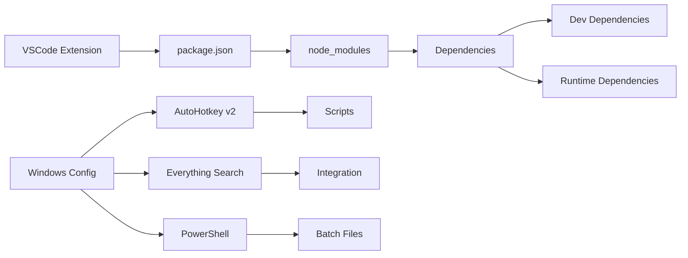

# Daily Development Review - July 10, 2025

## Overview
This document provides a comprehensive review of all development activities and changes made on July 10, 2025, across the project workspace.

## Key Terms
- **Repository Clone**: Initial setup of a project from a remote source
- **Git Commit**: A snapshot of changes in version control
- **AutoHotkey (AHK)**: Windows automation scripting language
- *Everything Search*: Fast file search utility for Windows
- `node_modules`: Directory containing npm package dependencies
- **Hotkey**: Keyboard shortcut for triggering actions
- *Batch File*: Windows script file for automating commands

## Project Activity Summary

### 1. VSCode Markdown Preview Enhanced
- **Status**: Fresh clone/initialization
- **Time**: 09:06:16 - 09:26:00
- **Key Actions**:
  - Repository initialized with complete git structure
  - All source files synchronized
  - Dependencies installed via npm

### 2. Windows Configuration
- **Status**: Active development
- **Commits**: 12 new commits
- **Focus**: AutoHotkey automation improvements

## Detailed Change Analysis

### Concept Map: Today's Development Focus

#### Node Glossary

| Node | Meaning |
|------|---------|
| Daily Development | Root node representing all work done today |
| VSCode Extension | Markdown Preview Enhanced extension project |
| Windows Config | Windows automation and configuration project |
| Repository Setup | Initial git repository configuration |
| Dependency Install | NPM package installation process |
| AutoHotkey Scripts | Windows automation scripts using AHK |
| Batch Files | Windows command scripts for automation |
| Everything Integration | Integration with Everything search tool |
| Auto-Restart | Feature for automatic script reloading |
| Hotkey Management | Keyboard shortcut configuration |
| Window Handling | Managing application window behavior |
| Search Shortcuts | Quick access to search functionality |

### Windows Config Commit Timeline

#### Node Glossary

| Node | Meaning |
|------|---------|
| Developer | The person making changes to the codebase |
| Git Repository | Version control system storing the code |
| AutoHotkey | Windows automation tool being configured |
| Batch Scripts | Windows command scripts being modified |

### Feature Development Flow

#### Node Glossary

| Node | Meaning |
|------|---------|
| Start Development | Beginning of today's development session |
| Language Update Needed? | Decision point for file naming conventions |
| Convert to English | Process of renaming files to English |
| Feature Development | Main development work phase |
| Everything Search? | Decision to work on search integration |
| Update Hotkeys | Modifying keyboard shortcuts |
| Improve Window Handling | Enhancing window management features |
| Batch Files? | Decision to work on batch scripts |
| Fix PowerShell Syntax | Correcting script syntax errors |
| Auto-Restart? | Decision to add restart functionality |
| Update to AHK v2 | Upgrading to AutoHotkey version 2 |
| Add Restart Feature | Implementing automatic restart |
| Complete | End of development cycle |

### Project Dependencies Architecture

#### Node Glossary

| Node | Meaning |
|------|---------|
| VSCode Extension | Main extension project |
| package.json | Node.js project configuration file |
| node_modules | Directory containing installed packages |
| Dependencies | Required external packages |
| Dev Dependencies | Packages needed only for development |
| Runtime Dependencies | Packages needed for execution |
| Windows Config | Windows automation project |
| AutoHotkey v2 | Version 2 of the automation tool |
| Everything Search | File search utility |
| PowerShell | Windows command-line shell |
| Scripts | AutoHotkey automation scripts |
| Integration | Connection between tools |
| Batch Files | Windows command scripts |

## Key Achievements

### VSCode Markdown Preview Enhanced
1. **Complete Repository Setup**
   - Full git initialization at 09:06:16
   - All source files synchronized
   - Project structure established

2. **Dependency Management**
   - NPM packages installed successfully
   - Development environment ready
   - All required modules present

### Windows Configuration
1. **Language Standardization**
   - Converted all file names to English
   - Improved code clarity and accessibility
   - Better international collaboration support

2. **Everything Search Enhancement**
   - Changed hotkey from backtick to double-click E
   - Added double-click backtick alternative
   - Improved window focus handling

3. **AutoHotkey Improvements**
   - Added auto-restart functionality for development
   - Updated to use AutoHotkey v2 directly
   - Enhanced script organization

4. **Batch File Optimization**
   - Fixed PowerShell syntax errors
   - Created comprehensive setup script
   - Improved automation reliability

## Technical Details

### Git Activity Timeline
- **09:17 - 09:26**: Active commit period
- **12 commits**: Focused improvements
- **Primary focus**: Automation and usability

### File System Changes
- **VSCode Extension**: ~1000+ files added (clone)
- **Windows Config**: ~15 files modified
- **Configuration files**: Updated for better automation

## Recommendations for Tomorrow

1. **VSCode Extension**
   - Begin actual development work
   - Review project documentation
   - Set up development workflow

2. **Windows Configuration**
   - Test all AutoHotkey scripts thoroughly
   - Document the new hotkey combinations
   - Consider creating a user guide

3. **General**
   - Consider setting up automated testing
   - Document the development environment setup
   - Create backup of current configurations

## Conclusion

Today's development showed significant progress in two main areas:
1. Setting up a new VSCode extension project for future development
2. Improving Windows automation tools with better usability and English standardization

The focus on converting files to English and improving automation tools suggests a move toward more maintainable and accessible code. The addition of auto-restart functionality and improved search integration will enhance developer productivity.